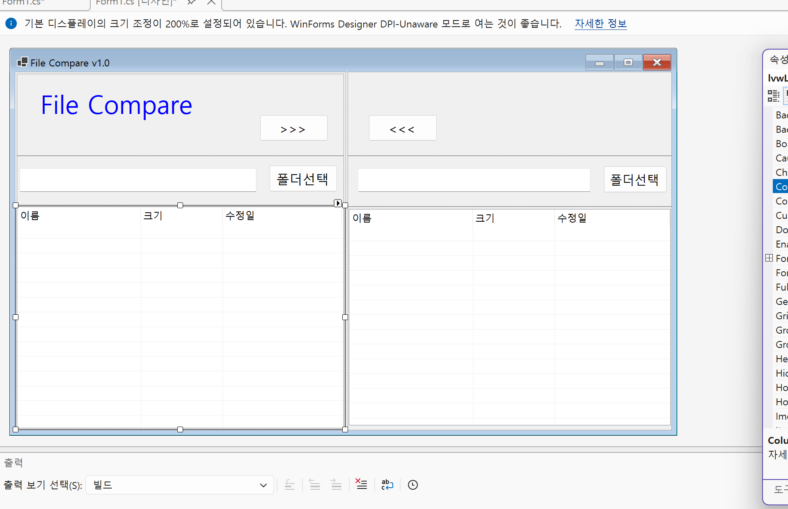

# FileCompare
# (c# 코딩)
## 개요
- c# 프로그래밍 학습
- 1줄 소개: 파일과 폴더를 다루는 기능
- 사용한 플랫폼:
  - c#, .NET Windows Forms, Visual Studio, GitHub
- 사용한 컨트롤: Panel, Label, Text Box, Button, Splitcontainer, ListView
- 사용한 기술과 구현한 기능:
  - visual studio를 이용하여 UI 디자인
  - 사용자 경험(UX) 개선
  - GUI 및 레이아웃 설계
  - 비교 알고리즘 및 시각적 피드백

## 실행 화면 (과제1)
- 코드의 실행 스크린샷과 구현 내용 설명

- 구현한 내용: 
   - UI 구성: Label을 활용해 앱 이름을 명확히 표시하고, 아이디와 패스워드 입력을 위한 TextBox 2개와 로그인 버튼을 배치하였습니다.
   - Placeholder 표시: 사용자의 편의를 위해 아이디와 패스워드 입력창 내부에 회색 힌트 텍스트를 설정하였습니다.
   - 로그인 및 초기화: 입력된 정보가 일치할 때만 로그인을 허용하며, 다시 주문하거나 시도할 수 있도록 모든 컨트롤을 초기화하는 기능을 구현하였습니다.
